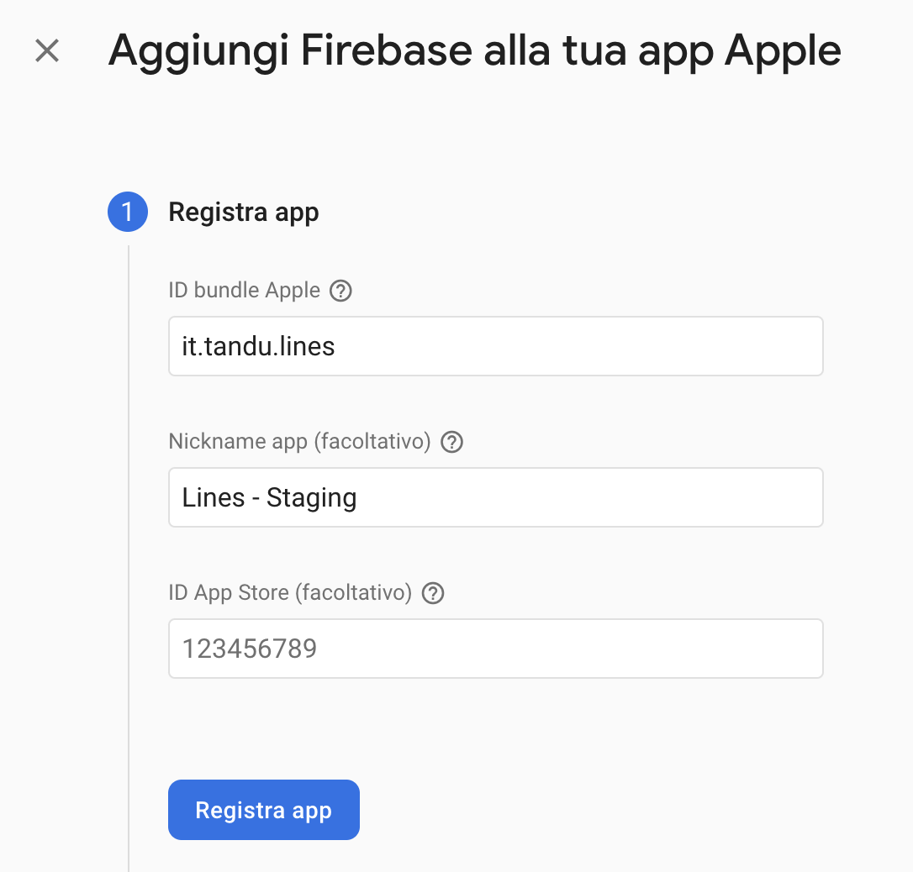

# Lines

App Flutter per il monitoraggio del ciclo.

## Impostare la lingua di base
### iOS

apri il file _projectname.xcodeproj/project.pbxproj_ e cerca  _developmentRegion_
```swift
developmentRegion = it;
```


## Impostare il nome dell'app
### Android

Apri il file `android/app/src/main/AndroidManifest.xml`
```xml
<application
        android:name="io.flutter.app.FlutterApplication"
        android:label="NOME APP"
        android:icon="@mipmap/ic_launcher">
```

### iOS

Apri il file `ios/Runner/Info.plist`
```xml
<key>CFBundleName</key>
<string>NOME APP</string>
```


## Firebase
Creare i progetti su [Firebase](https://firebase.google.com/)

Dalla console Firebase aggiungere Firebase alla tua app Flutter.

Verrà richiesto di eseguire i seguenti comandi nella directory principale del progetto Flutter:
```bash
dart pub global activate flutterfire_cli
flutterfire configure --project=lines-fed32
```

Una volta completata la procedura aggiungere il seguente codice nel file _main.dart_ per inizializzare Firebase

```dart
FutureOr<void> main() async {
  // Aspetto che l'app venga interamente inizializzata
  WidgetsFlutterBinding.ensureInitialized();
  await _initApp();

  runApp(const App());
}

_initApp() async {
  [...]
  await _initFirebase();
}

_initFirebase() async {
  await Firebase.initializeApp(
    options: DefaultFirebaseOptions.currentPlatform,
  );
}
```

### Creare i progetti per Firebase Distribution
Una volta creato il progetto aggiungere le app _dev_ e _prod_ sia Android che iOS.




## Flavors

La prima cosa da fare con un nuovo progetto è la generazione dei flavors, gli ambienti di sviluppo.

Aggiungere le seguenti righe nel file _pubpsec.yml_ e impostare i parametri specifici del progetto per creare 2 flavors: _dev_ e _prod_

```yaml
# Flavors
flavorizr:
  app:
    android:
      flavorDimensions: "flavor-type"

  flavors:
    dev:
      app:
        name: "Lines"
      android:
        applicationId: "it.tandu.lines"
        firebase:
          config: "firebase/android/dev/google-services.json"
      ios:
        bundleId: "it.tandu.lines"
        firebase:
          config: "firebase/ios/dev/GoogleService-Info.plist"

    prod:
      app:
        name: "Lines"
      android:
        applicationId: "it.fater.lines" # FIXME:
        firebase:
          config: "firebase/android/prod/google-services.json"
      ios:
        bundleId: "it.fater.lines"
        firebase:
          config: "firebase/ios/prod/GoogleService-Info.plist"

```


e lanciare il seguente comando per generare i 2 flavors: dev e prod

```bash
make generate_flavors
```

## Generazione key per ambienti di produzione e debug
### Android

#### Development
```bash
cd android/app
keytool -genkey -v -alias LinesKeyDev -keyalg RSA -keysize 2048 -validity 10000 -storetype JKS -dname "CN=Lines,OU=IT,O=Lines,L=Italy,C=IT" -keystore LinesKeyDev.keystore  -storepass LinesPassword!
keytool -list -v -alias LinesKeyDev -keystore LinesKeyDev.keystore
keytool -list -v -keystore LinesKeyDev.keystore -alias LinesKeyDev -storepass LinesPassword! -keypass LinesPassword!
```

#### Produzione
```bash
keytool -genkey -v -alias LinesKey -keyalg RSA -keysize 2048 -validity 10000 -storetype JKS -dname "CN=Lines,OU=IT,O=Lines,L=Italy,C=IT" -keystore LinesKey.keystore  -storepass LinesPassword!
keytool -list -v -alias LinesKey -keystore LinesKey.keystore
keytool -list -v -keystore LinesKey.keystore -alias LinesKey -storepass LinesPassword! -keypass LinesPassword!
```

#### Verifica delle firme sha per Firebase

```bash
cd android; ./gradlew signingReport
```


#### Impostare le key generate 

Incollare nel file `app/build.gradle` il seguente codice:

```java
signingConfigs {
  debug {
    storeFile file("LinesKeyDev.keystore")
    storePassword "LinesPassword!"
    keyAlias "LinesKeyDev"
    keyPassword "LinesPassword!"
  }

  release {
    storeFile file("LinesKey.keystore")
    storePassword "LinesPassword!"
    keyAlias "LinesKey"
    keyPassword "LinesPassword!"
  }
}

buildTypes {
  debug {
    signingConfig signingConfigs.debug
  }
      
  release {
    signingConfig signingConfigs.release
  }
}
```


## Disabilitare rotazione schermo Android

Apri il file `android/app/src/main/AndroidManifest.xml`

Aggiungi  
```xml
<activity 
  ... 
  android:windowSoftInputMode="adjustResize"
  android:orientation="vertical"
>
```

## Login social

### Apple Login
**TODO**
### Facebook Login
```bash
keytool -exportcert -alias LinesKey -keystore LinesKey.keystore | openssl sha1 -binary | openssl base64
```

### Google Login
- Installare il plugin [google_sign_in](https://pub.dev/packages/google_sign_in) e seguire le istruzioni riportate nel README del plugin.
- Verificare i permessi sulla [Google Console](https://console.cloud.google.com/apis/credentials?authuser=1&project=flying-Lines-6d48b) del progetto.
- Nel controller aggiungere il seguente codice:


```dart
Future<void> _performGoogleSignin() async {
  try {
    // https://github.com/flutter/flutter/issues/75224
    GoogleSignIn googleSignIn = GoogleSignIn(scopes: ['email']);
    final GoogleSignInAccount? googleSignInAccount = await googleSignIn.signIn();

    if (googleSignIn.currentUser != null) {
      // Loggato con Google

      ...
    }

    ...
  } catch (error) {
    ...
  }
}

```


#### Android
- Seguire gli step descritti per generare le keys: [https://github.com/flutter/flutter/issues/75224](https://github.com/flutter/flutter/issues/75224)
- Controllare su Firebase la sezione **Impronte digitali certificato SHA**
che siano impostate le keys ottenute con questo comando:

```bash
cd android/app
keytool -list -v -alias LinesKey -keystore LinesKey.keystore
```

#### iOS
È sufficiente seguire gli step descritti nella guida del plugin [google_sign_in](https://pub.dev/packages/google_sign_in).


https://digitalassetlinks.googleapis.com/v1/statements:list?source.web.site=https://lines.tandu.it&relation=delegate_permission/common.handle_all_urls